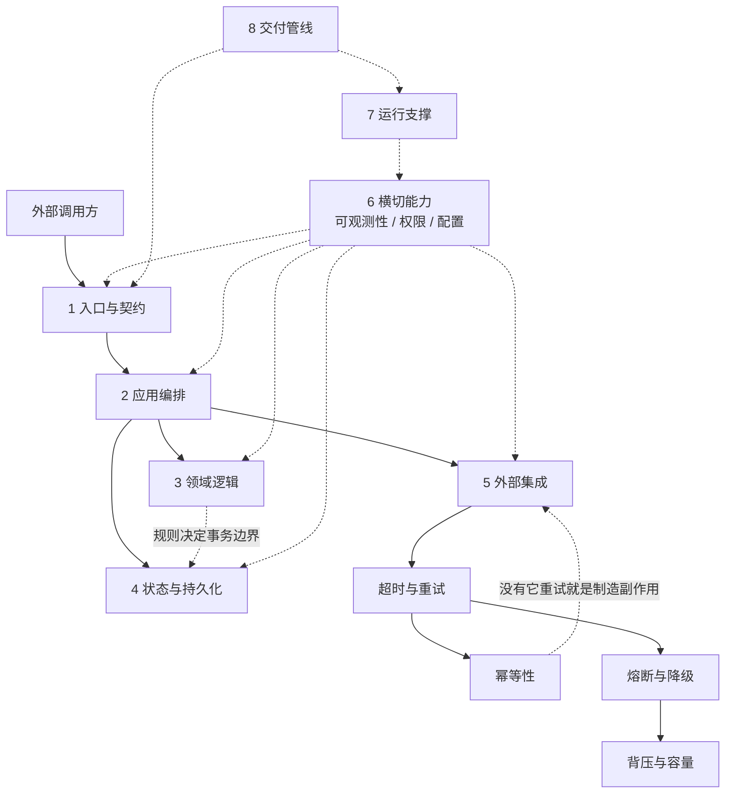

# 系统组成总览 · System Anatomy

这份文档回答一个问题：**一个软件系统由哪些部分组成，每一部分起什么作用，动一块会牵连哪几块。**

它和另外几份总览是同一个对象的**不同切面**，不是替代关系：

| 文档 | 切面 | 回答的问题 |
|---|---|---|
| [`maps/software.md`](../maps/software.md) | 依赖 | 这些概念谁是谁的前置，按什么顺序读 |
| [`docs/software-composition.md`](software-composition.md) | 时间 | 一条软件从设计到退役要过哪些关 |
| **本文** | **空间** | **它由哪几块构成，每块干什么，改一处会牵连谁** |

前两份讲"顺序"，本文讲"结构"。顺序错了会读不懂，结构错了会改坏东西——后者更贵。

> **定位**：结构地图，不是事实依据。本文不含新事实，是对 [`concepts/software/`](../concepts/software/) 24 张卡片 + Agent 域若干卡片的**重新组织**，这些卡片的信源等级见各卡属性表。涉及缺口的段落已显式标注为缺口，不是结论。

---

## 一句话总述

**系统的组成不是目录结构，而是四道边界。**

目录树按技术类型分（controllers / services / models / utils），一个功能的代码散在四处；边界按"什么会一起变"分，一个功能的改动落在一处。所以看一个系统由哪些部分组成，要看它划了哪四道边界：

| 边界 | 划开的两侧 | 破了会怎样 |
|---|---|---|
| **外部边界** | 系统内 / 系统外 | 调用方直接依赖内部实现，任何重构都是破坏性变更 |
| **内部边界** | 做什么（编排）/ 是什么规则（领域） | 业务规则散进流程代码，改规则要全库搜索 |
| **状态边界** | 内存中的计算 / 必须落盘的事实 | 不知道"什么必须一次成功"，并发问题无法推理 |
| **支撑边界** | 业务能力 / 让业务能力可运行、可发现的那些东西 | 系统能跑，但出问题定位不了、发不出去、回不来 |

下面八个部分，就是这四道边界的具体落点。

---

## 总图

实线 = 调用或依赖方向，虚线 = 影响方向（"这边一改，那边要跟着检查"）。节点不加链接（GitHub 对图内链接支持不稳定），链接在下面的表里。

图里有一处需要说明：**第 6 部分（横切能力）连向所有其它部分**。这不是画法偷懒——它没有自己的业务职责，它的职责是"让其它七块的行为可被外部推断"。这决定了它在依赖图上是根节点，但在影响图上是所有节点的下游。

---

## 八个部分

| 部分 | 起什么作用 | 不做会怎样 | 对应卡片 | 缺口 |
|---|---|---|---|---|
| **1 入口与契约** | 把外部请求转成内部调用，并承诺"调用方可以依赖什么、可以用多快" | 调用方靠猜，猜错就是生产事故 | [契约与接口设计](../concepts/software/contract-design.md) · [契约测试](../concepts/software/contract-testing.md) · [语义化版本](../concepts/software/semantic-versioning.md) · [API 风格取舍与限流](../concepts/software/api-design-and-rate-limiting.md) · [认证与授权](../concepts/software/authentication-and-authorization.md) | 无 |
| **2 应用编排** | 决定"做哪些步骤、按什么顺序做、失败到哪一步算完" | 流程控制散落在各层，同一用例在不同入口行为不一致 | [分层架构](../concepts/software/layered-architecture.md) · [依赖注入](../concepts/software/dependency-injection.md) | 工作流与状态机（长流程） |
| **3 领域逻辑** | 承载业务规则，让规则有归属 | 规则散进服务方法，改一条规则要全库搜索 | [领域模型](../concepts/software/domain-model.md) · [单一职责](../concepts/software/single-responsibility.md) | 无（本库覆盖最完整的一块） |
| **4 状态与持久化** | 决定什么必须一次成功、什么可以最终一致 | 并发行为与失败恢复无法推理 | [事务与 ACID](../concepts/software/transactions-acid.md) · [隔离级别与并发异常](../concepts/software/transaction-isolation.md) · [索引与查询计划](../concepts/software/index-and-query-plan.md) · [范式化与反范式化](../concepts/software/normalization.md) · [复制与一致性模型](../concepts/software/replication-and-consistency.md) · [分片与分区](../concepts/software/sharding-and-partitioning.md) · [schema 迁移与版本化](../concepts/software/schema-migration.md) · [连接池与容量](../concepts/software/connection-pooling.md) | 无（8 张卡已齐，是本库目前覆盖最完整的一条线） |
| **5 外部集成** | 与不受你控制的系统打交道，并承担对方会失败这件事 | 一个依赖变慢拖垮整个系统 | [超时、重试与退避](../concepts/software/timeout-retry-backoff.md) · [熔断与降级](../concepts/software/circuit-breaker.md) · [背压与容量](../concepts/software/backpressure.md) · [幂等性](../concepts/software/idempotency.md) · [缓存策略](../concepts/software/caching-strategies.md) | 出站流量的配额（入站限流已有卡） |
| **6 横切能力** | 让前五块的行为从外部可推断、可约束 | 系统能跑，但"慢了""错了""被越权了"都定位不了 | [可观测性](../concepts/software/observability.md) · [认证与授权](../concepts/software/authentication-and-authorization.md) · [输入校验](../concepts/software/input-validation.md) · [加密与密钥管理](../concepts/software/encryption-and-key-management.md) · [轨迹可观测性与回放](../concepts/agent/trajectory-observability.md)（Agent 域） | 配置与密钥管理 |
| **7 运行支撑** | 让系统在真实负载与真实故障下持续可用 | 上线只是开始，之后每次故障都靠人硬扛 | [部署与发布策略](../concepts/software/deployment-strategies.md) · [SLO 与错误预算](../concepts/software/slo-and-error-budget.md) · [告警与值班](../concepts/software/alerting-and-on-call.md) · [配置管理](../concepts/software/configuration-management.md) · [基础设施即代码](../concepts/software/infrastructure-as-code.md) · [事故响应与复盘](../concepts/software/incident-response.md) · [容量规划与成本核算](../concepts/software/capacity-planning.md) · [可观测性](../concepts/software/observability.md) · [背压与容量](../concepts/software/backpressure.md) | 无（9 张卡已齐） |
| **8 交付管线** | 让"改动能安全进主线、出问题能回到上一版" | 不敢改、不敢发，或发了之后不知道该回到哪一版 | [版本控制与分支策略](../concepts/software/version-control-branching.md) · [代码审查](../concepts/software/code-review.md) · [测试金字塔](../concepts/software/test-pyramid.md) · [可复现构建](../concepts/software/reproducible-build.md) · [变更日志](../concepts/software/changelog.md) · [架构决策记录 ADR](../concepts/software/adr.md) · [依赖供应链](../concepts/software/dependency-supply-chain.md) | CI/CD 本身、制品仓库、灰度与回滚 |

**一张表读下来的结论**：**八个部分现在都有卡片可查**，其中 3、4、6、7、8 五块已补齐，1、2、5 三块覆盖良好（第 2 部分仍差"长流程的工作流与状态机"）。**八块里没有一块是空区了**——这是本库第一次可以说这句话。

但必须说清这意味着什么：**补齐的是"有卡片可查"，不是"这些卡已经可信"**。112 张卡片的信源等级仍是 `link-checked`（引用没引错，正文未逐条核对），且其中 35 张是同一轮批量补写的——**规模上去了，验证没跟上**。这是当前最大的债务，见[核查记录](verification-log.md)与[第 2 轮核查清单](round2-verification-checklist.md)。

---

## 逐部分：每块在干什么

### 1 入口与契约 —— 承诺调用方可以依赖什么

入口的职责听起来只是"接收请求"，真正决定成败的是它**承诺了什么**。契约包含三部分：结构（字段与类型）、语义（含义、单位、取值范围）、行为（错误语义、幂等性、一致性、超时预期）。

**schema 表达不了语义。** 所以结构变了机器能发现，含义变了机器发现不了——这是最危险的一类变更，只有了解业务的人能识别（见[契约与接口设计](../concepts/software/contract-design.md)）。

判断依据：写下"调用方可以依赖这个接口的哪些性质"。写不出来，说明这份契约还不存在。

### 2 应用编排 —— 步骤归步骤，规则归规则

编排回答"做哪些步骤"，领域回答"业务规则是什么"。混在一起的后果很具体：规则既无法复用，也无法在不启动数据库的情况下测试。

这一块是**依赖注入**真正发挥作用的地方：协作者从外部传入，编排才可能在测试里被替换。注意 DI 是模式，DI 容器只是工具，两者不是一回事（见[依赖注入](../concepts/software/dependency-injection.md)）。

判断依据：把内层代码的 import 列表拉出来看。出现框架、ORM、HTTP 客户端的名字，说明依赖方向已经破了——这时候名字上还叫分层，实际只剩目录形状。

### 3 领域逻辑 —— 规则得有归属

领域模型与数据模型的差别不在有没有类，而在**规则写在谁身上**。规则跟着数据走，改业务规则时只看一个地方；规则散在服务层，就得全库搜索。

聚合是这一块最重要的构件，因为它**定义事务边界**：聚合内的一次事务保证不变式，跨聚合只能是最终一致。这一条直接决定并发行为与失败恢复方式，也直接连到第 4 部分。

但要提醒：**领域模型不是所有系统的正确答案。** 以数据搬运转发为主的系统（表单、报表、集成）用领域模型会带来大量无意义的映射代码，简单的数据模型加服务层更合适（见[领域模型](../concepts/software/domain-model.md)）。

### 4 状态与持久化 —— 什么必须一次成功

这一块回答两个问题：**什么状态必须原子地改变**，以及**什么状态可以晚一点一致**。它由第 3 部分的聚合边界决定，而不是由数据库选型决定。

**单库部分已覆盖**：

| 卡 | 它回答什么 |
|---|---|
| [事务与 ACID](../concepts/software/transactions-acid.md) | 哪组操作必须一起生效；以及"事务不能让重试变安全"这条关键边界 |
| [隔离级别与并发异常](../concepts/software/transaction-isolation.md) | 并发事务能看到什么、允许哪些异常、什么时候必须准备重试 |
| [索引与查询计划](../concepts/software/index-and-query-plan.md) | 定位数据的代价从哪来；"索引存在"与"索引被用"的区别 |
| [范式化与反范式化](../concepts/software/normalization.md) | 冗余该不该有、由谁负责同步、不同步会怎样 |

**分布式那一半也已覆盖**：

| 卡 | 它回答什么 |
|---|---|
| [复制与一致性模型](../concepts/software/replication-and-consistency.md) | 多副本下"读到的算不算最新"；同步与异步复制的取舍；**复制不是备份** |
| [分片与分区](../concepts/software/sharding-and-partitioning.md) | 容量上限怎么突破，以及为什么分片是**不可逆的架构决策**而不是优化 |
| [schema 迁移与版本化](../concepts/software/schema-migration.md) | 结构与代码如何跨版本共存；为什么"**数据不能回滚**" |
| [连接池与容量](../concepts/software/connection-pooling.md) | 应用与数据库之间的并发上限定在哪；过载时谁先失败 |

**这八张合起来才构成"状态边界"**：单库那四张讲"一次操作内部怎么保证"，分布式这四张讲"多个节点之间怎么保证"。少任何一半，下一节的链五都画不全。

Agent 域的[结构化状态与外部存储](../concepts/agent/structured-state.md)是同一问题在 Agent 场景下的形态（状态怎么落到外部记录），可对照读。

### 5 外部集成 —— 假设对方一定会失败

外部依赖与内部代码的根本差别：**你不控制它，所以它一定会在某个时刻变慢、报错、返回你不认识的东西。**

这一块的四张卡是配套的，不能单独摘一张用：

| 手段 | 解决的问题 | 单独用的后果 |
|---|---|---|
| [超时与重试](../concepts/software/timeout-retry-backoff.md) | 偶发失败 | 重试会放大故障——对方已经过载，你还在加压 |
| [熔断与降级](../concepts/software/circuit-breaker.md) | 对方持续不可用 | 熔断没有降级方案，等于把失败直接转给用户 |
| [背压与容量](../concepts/software/backpressure.md) | 自己处理不过来 | 背压只有一层做，压力会在别处堆积 |
| [幂等性](../concepts/software/idempotency.md) | 重试产生重复副作用 | 没有它，重试是在制造重复写入 |

**重试的每一次调用都必须是幂等的**，这是这四张卡之间最硬的一条约束。

### 6 横切能力 —— 让前五块可被观察、可被约束

它没有业务职责，价值体现在"其它部分出问题时你能不能知道"。三类信号的分工是：**从指标发现异常 → 用追踪定位环节 → 用日志看细节**；三类缺一，定位链就断在某一环。

两个容易做错的地方：延迟要看**分位数不是平均值**（平均值会掩盖长尾，而长尾正是用户感受到的）；高基数维度（用户 ID、请求 ID）**不能进指标**，会撑爆存储，它们该进追踪与日志。

一条常被忽略的结论：**可观测性不是运维的事**。它要求代码层面主动埋点并传递关联标识——否则三类信号是三个孤岛（见[可观测性](../concepts/software/observability.md)）。

**安全与可观测性同属横切，但方向相反**：可观测性让行为**可见**，安全让行为**受限**。这一块的三张安全卡各管一层，且不可互替：

| 卡 | 它挡什么 | 它挡不住什么 |
|---|---|---|
| [认证与授权](../concepts/software/authentication-and-authorization.md) | 未授权的主体与动作 | 合法主体提交的恶意数据 |
| [输入校验](../concepts/software/input-validation.md) | 跨边界的每一份数据 | 有权限的人做有权限的事 |
| [加密与密钥管理](../concepts/software/encryption-and-key-management.md) | 数据被拿到后的明文泄露 | 运行中的应用自己解密（应用被攻破时） |

**校验挡不住越权，授权挡不住注入，加密挡不住应用被攻破**——这三句是这一块的边界。

### 7 运行支撑 —— 上线只是开始

这一块由三部分构成，各自回答不同的问题：

| 卡 | 它回答什么 |
|---|---|
| [部署与发布策略](../concepts/software/deployment-strategies.md) | 新版本怎么切流量、怎么退回去 |
| [SLO 与错误预算](../concepts/software/slo-and-error-budget.md) | "够好"由谁定义、什么时候该冻结变更 |
| [告警与值班](../concepts/software/alerting-and-on-call.md) | 什么情况值得半夜叫人 |
| [事故响应与复盘](../concepts/software/incident-response.md) | 出事时先做什么、事后怎么改进 |
| [容量规划与成本核算](../concepts/software/capacity-planning.md) | 还能撑多少、再加一份要多少钱 |
| [配置管理](../concepts/software/configuration-management.md) · [基础设施即代码](../concepts/software/infrastructure-as-code.md) | 环境与资源的定义怎么受控 |

这一块的共同性质：**它们全都在"系统已经写完之后"才开始发挥作用**，所以最容易被推迟——而推迟的代价在第一次真实故障时一次性付出。

### 8 交付管线 —— 让改动可进、可退

这一块的判断标准只有一条：**敢不敢在周五下午发版。** 不敢，说明这条管线有洞。

拆开看：测试给出"对不对"的证据（[测试金字塔](../concepts/software/test-pyramid.md)），审查给出"能不能进主线"的把关（[代码审查](../concepts/software/code-review.md)），[可复现构建](../concepts/software/reproducible-build.md)给出"这一版到底是什么"的确定性，[版本号](../concepts/software/semantic-versioning.md)与[变更日志](../concepts/software/changelog.md)给出"改了什么、能不能升"的结论，[ADR](../concepts/software/adr.md)给出"当初为什么这么定"的上下文。

其中 ADR 是**收益最高、成本最低**的一条：几行字，替代未来一次完整的重新论证。

---

## 相互影响：动一处会牵连哪几处

这一节是本文的重点。上面的八个部分不是八个独立盒子——**真正的工程事故大多不是某一块写错了，而是改了一块、没同步另一块。**

### 五条主要影响链

**链一：契约 → 调用方 → 版本号 → 变更日志**
改接口字段含义，结构没变，schema 检查和编译都通过，但调用方的假设已经失效。这条链上任何一处没同步，破坏性变更就会静默流到生产。防法是让契约里"可依赖的性质"变成可执行的[契约测试](../concepts/software/contract-testing.md)，而不是文档条款。

**链二：领域规则 → 事务边界 → 并发行为 → 失败恢复**
规则放在哪，决定聚合怎么划；聚合怎么划，决定"什么必须一次成功"；这一条又决定并发下的行为和出错后怎么恢复。**改一处规则归属，等于同时改了三件事**——这是重构领域代码比看起来更危险的原因。

**链三：外部调用 → 超时 → 重试 → 幂等 → 熔断 → 背压**
五者是一条链，不是五张可选卡。调长超时会影响重试次数，改重试策略会影响熔断阈值，加熔断必须准备降级，加背压要求上下游都配合。**只调其中一项，压力会被推到链上的另一环。**

**链四：可观测性 → 其它全部**
没有关联标识与结构化日志，链一到链三的任何问题都只能靠猜。它的特殊性在于：**它不是被影响的一方，而是"能不能发现影响"的前提。**

**链五：状态边界 → 并发 → 失败恢复 → 重试策略**
单库靠[隔离级别](../concepts/software/transaction-isolation.md)约束并发，但**隔离级别管不到跨节点的读写**——数据一旦分布在多个节点上，"什么必须一次成功"的答案由[复制模型](../concepts/software/replication-and-consistency.md)与[分片方式](../concepts/software/sharding-and-partitioning.md)给出。于是改分片键或复制策略，等于同时改并发行为与失败恢复路径，而这两条又决定链三里重试策略是否还成立。

**这条链是最后接通的一条**：在分布式那四张卡写出来之前，它只能写到"隔离级别管不到跨节点"就断掉——**断了的地方，恰好是绝大多数线上一致性事故的发生地。**

### 影响面速查表

改动之前先查这张表：

| 你改了什么 | 必须同时检查 | 为什么 |
|---|---|---|
| 接口字段含义 | 契约测试 · 版本号 · 调用方 · 变更日志 | 结构没变，静态检查发现不了 |
| 接口加必填字段 | 版本号（主版本）· 所有调用方 | 加必填不是兼容变更 |
| 聚合边界 / 规则归属 | 事务边界 · 并发行为 · 测试分层 | 聚合定义事务边界，规则搬位置会改变可测性 |
| 隔离级别 | 需要重试的事务 · 业务不变式 · 幂等键 | 可串行化会主动中止事务，应用必须准备重试 |
| 新增索引 | 写入路径 · 存储 · 优化器选择 | 索引把成本从读搬到写；索引存在 ≠ 被使用 |
| 分片键 / 复制策略 | 并发语义 · 失败恢复 · 重试策略 | 链五：跨节点后隔离级别不再覆盖 |
| schema 结构变更 | 旧代码 · 回滚能力 · 回填耗时 | 数据不能回滚，破坏性变更必须跨多次发布 |
| 池大小 / 实例数 | 数据库连接上限 · 获取连接等待时间 | 实例数 × 池上限会随扩容同步变大 |
| 发布方式 / 放量比例 | 新旧版本兼容性 · 回滚路径 · 指标可按版本切分 | 滚动与金丝雀期间，两个版本**同时在线**是默认状态 |
| 配置变更 | 所属层级（影响面）· 回滚方式 · 与故障时间线的关联 | 热更新绕过了重启这道自然闸门，变更与故障更难关联 |
| SLO 目标 | 错误预算 · 发布准入 · 容量余量 | 目标调严等于预算变少，会直接冻结变更 |
| 超时值 | 重试次数 · 熔断阈值 · 背压 · 幂等性 | 链三：五者配套 |
| 重试策略 | 幂等性 · 下游容量 | 不幂等的重试 = 重复副作用 |
| 日志或指标维度 | 存储成本 · 定位能力 | 高基数维度进指标会撑爆存储 |
| 构建方式 | 可复现性 · 回滚能力 | 不可复现的构建无法确定回滚到哪一版 |
| 依赖版本 | 供应链可信 · 锁定策略 | 构建今天过、明天不一定过 |
| 领域术语 | 通用语言 · 模型命名 · 术语表 | 名字脱节后模型会变成没人维护的翻译层 |
| 一次重要技术决策 | ADR | 不记，未来要重新论证一遍 |

### 一个反面用法

这张表不能反向使用。**"表里没写"不等于"改它安全"。** 表只覆盖本库已有卡片能支撑的关联。

数据与一致性补齐 8 张卡后，这张表比第一版多了五行（隔离级别、索引、分片键、schema 变更、池大小）。但**安全、运维、并发三块仍然空缺**——遇到那些领域的改动，仍然要意识到自己是缺工具的，而不是以为风险已经排除了。

---

## 三处最容易断的接缝

**1. 契约语义 与 契约测试之间。** 结构有 schema 兜底，语义只有人能看。接缝断了的症状：接口测试全绿，生产出语义事故。

**2. 领域规则 与 事务边界之间。** 贫血模型让规则离开了领域对象，事务边界随之失去依据，最后变成"哪里方便就在哪里开事务"。接缝断了的症状：并发下偶发不一致，且复现不了。

**3. 可观测性 与 其他一切之间。** 埋点常被当成"上线前补一下"的收尾工作，而它要求的关联标识必须**从入口一路传下去**——等想起来再补，往往要动所有层。接缝断了的症状：能收到告警，但定位不了原因。

---

## 本库在这一视角下的缺口

按上表，第 4 部分（状态与持久化）已补齐；缺的是第 6、7 两部分（不依赖具体产品，按本库自己的收录标准应当收录）：

- **数据与一致性**：**已全部补齐（8/8）** —— [事务与 ACID](../concepts/software/transactions-acid.md) · [隔离级别与并发异常](../concepts/software/transaction-isolation.md) · [索引与查询计划](../concepts/software/index-and-query-plan.md) · [范式化与反范式化](../concepts/software/normalization.md) · [复制与一致性模型](../concepts/software/replication-and-consistency.md) · [分片与分区](../concepts/software/sharding-and-partitioning.md) · [schema 迁移与版本化](../concepts/software/schema-migration.md) · [连接池与容量](../concepts/software/connection-pooling.md)
- **安全**：**已全部补齐（4/4）** —— [认证与授权](../concepts/software/authentication-and-authorization.md) · [加密与密钥管理](../concepts/software/encryption-and-key-management.md) · [输入校验](../concepts/software/input-validation.md) · [依赖供应链](../concepts/software/dependency-supply-chain.md)（配置与密钥管理的密钥侧已覆盖，配置侧仍缺）
- **运维**：**已全部补齐（7/7）** —— [部署与发布策略](../concepts/software/deployment-strategies.md) · [SLO 与错误预算](../concepts/software/slo-and-error-budget.md) · [告警与值班](../concepts/software/alerting-and-on-call.md) · [配置管理](../concepts/software/configuration-management.md) · [基础设施即代码](../concepts/software/infrastructure-as-code.md) · [事故响应与复盘](../concepts/software/incident-response.md) · [容量规划与成本核算](../concepts/software/capacity-planning.md)
- **并发**：已补 [并发与锁](../concepts/software/concurrency-and-locking.md) · [竞态与内存模型](../concepts/software/memory-model-and-races.md)；**更高层的并发范式（Actor 模型、CSP）仍未覆盖**
- **性能**：已补 [性能剖析](../concepts/software/profiling.md) · [缓存策略](../concepts/software/caching-strategies.md)；**批处理与延迟预算未专门覆盖**
- **网络与协议**：已补 [API 风格取舍与限流](../concepts/software/api-design-and-rate-limiting.md)；**协议层（HTTP/2、HTTP/3、服务网格）未覆盖**
- **构建与依赖**：已补 [依赖供应链](../concepts/software/dependency-supply-chain.md)；锁定策略与依赖图未专门成卡

这份缺口清单已登记在[清单](../roadmap.md)的「缺口登记（第四批）」；本文只负责指出它们**与系统的哪一块相关**。两处说的必须是同一件事——清单写"待写 0"而正文列着缺口，是这个库最不该出现的一种失真。

---

## 从哪读起

按"先能画出结构，再逐个补齐"排：

| 顺序 | 读什么 | 建立什么认识 |
|---|---|---|
| 1 | [分层架构与模块边界](../concepts/software/layered-architecture.md) | 四道边界里"内部边界"的那一条：编排与规则为什么必须分开 |
| 2 | [依赖注入](../concepts/software/dependency-injection.md) | 边界靠什么机制落地——协作者从外部传入 |
| 3 | [契约与接口设计](../concepts/software/contract-design.md) | 外部边界承诺了什么，以及为什么语义变更最危险 |
| 4 | [领域模型](../concepts/software/domain-model.md) | 规则归属与聚合，顺带理解它什么时候是负担 |
| 5 | [超时、重试与退避](../concepts/software/timeout-retry-backoff.md) | 影响链三的起点；另外三张运行卡都以它为前提 |
| 6 | [可观测性](../concepts/software/observability.md) | 影响链四：为什么它是"能不能发现问题"的前提 |
| 7 | [版本控制与分支策略](../concepts/software/version-control-branching.md) | 进入交付管线整条线 |

前 4 张读完，八个部分的结构就能自己画出来了。

---

**相关**：[软件工程组成总览](software-composition.md)（生命周期视角）· [软件工程地图](../maps/software.md)（依赖图）· [Agent 组成总览](agent-composition.md) · [总图](../maps/overview.md)
