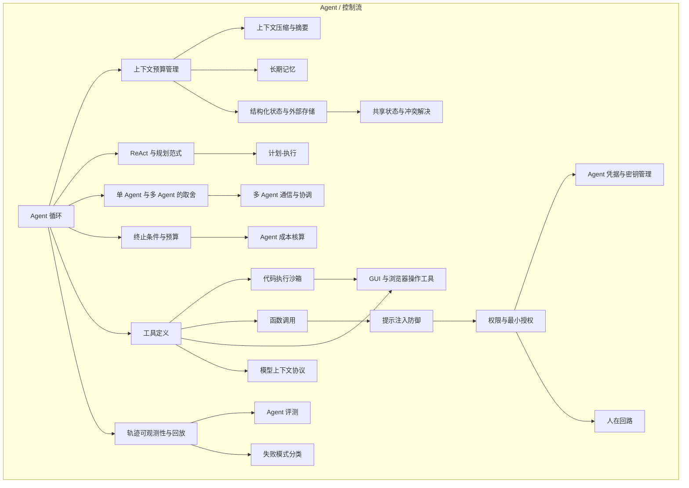

# Agent 地图 · Agent Map

Agent 的复杂度不在模型，在**循环周边的四件事**。四件事里任何一件没做，系统就上不了线。

> 这张图只画依赖关系。把四件事"各解决什么问题、每部分起什么作用"讲成文字的版本，见 [`docs/agent-composition.md`](../docs/agent-composition.md)。

---

## 四条线



---

## 1 控制流 —— 下一步是谁决定的

这一整块的判断标准只有一条：**下一步做什么，由模型在运行时产生，还是由人预先写死。**

| 概念 | 卡片 |
|---|---|
| Agent 循环 | [Agent 循环](../concepts/agent/agent-loop.md) |
| 终止条件与预算控制 | [终止条件与预算](../concepts/agent/termination-and-budget.md) |
| ReAct 与规划范式 | [ReAct 与规划范式](../concepts/agent/react-and-planning.md) |
| Plan-and-Execute | [计划-执行](../concepts/agent/plan-and-execute.md) |
| 单 Agent vs 多 Agent 的取舍 | [单/多 Agent 取舍](../concepts/agent/single-vs-multi-agent.md) |

**能用 Workflow 解决的不要用 Agent。** 路径可以事先枚举时，Workflow 更便宜、更快、可测试。Agent 的价值只存在于"路径事先无法枚举"的场景——这条界限被跨过之后，下面三条线全部变成必需品而不是可选项。

---

## 2 工具 —— 模型的手

工具这一层的质量，对成功率的影响**不低于模型选择**：模型只在给定描述下选择调用，描述没写清楚的能力它不会用，也不会自己发现。

| 概念 | 卡片 |
|---|---|
| 工具定义与 JSON Schema | [工具定义](../concepts/agent/tool-definition.md) |
| 函数调用 Function Calling | [函数调用](../concepts/agent/function-calling.md) |
| MCP 模型上下文协议 | [MCP](../concepts/agent/mcp.md) |
| 代码执行沙箱 | [代码执行沙箱](../concepts/agent/code-execution-sandbox.md) |

**一个需要记住的边界**：模型输出 → 实际执行之间是**不可信边界**，所有校验都要放在这条线上。这条原则同时是提示注入防御和权限控制的基础。

---

## 3 状态与记忆 —— 它其实没有状态

关键认识：**Agent 没有内部状态变量，它的"我做到哪了"完全依赖把历史重放进上下文**（根在 [上下文窗口](../concepts/ai/context-window.md)）。

所以上下文一旦被截断或污染，Agent 会"失忆"或"记错"，外部表现为重复动作、目标漂移。**长任务跑崩的主因是上下文预算管理，不是模型能力。**

| 概念 | 卡片 |
|---|---|
| 上下文预算管理 | [上下文预算管理](../concepts/agent/context-budget.md) |
| 上下文压缩与摘要 | [上下文压缩](../concepts/agent/context-compression.md) |
| 结构化状态与外部存储 | [结构化状态](../concepts/agent/structured-state.md) |
| 长期记忆 | [长期记忆](../concepts/agent/long-term-memory.md) |

这一条线有一个递进关系：**压缩**是在窗口内腾挪 → **结构化状态**把关键状态移出窗口 → **长期记忆**跨会话保留。三者的边界是"这份信息要活多久"。

---

## 4 质量与安全 —— 没有轨迹就无法调试

| 概念 | 卡片 |
|---|---|
| 轨迹可观测性与回放 | [轨迹可观测性](../concepts/agent/trajectory-observability.md) |
| 失败模式分类 | [失败模式分类](../concepts/agent/failure-modes.md) |
| 提示注入防御 | [提示注入防御](../concepts/agent/prompt-injection-defense.md) |
| 权限与最小授权 | [权限与最小授权](../concepts/agent/least-privilege.md) |
| 人在回路确认点 HITL | [人在回路](../concepts/agent/human-in-the-loop.md) |
| Agent 评测 | [Agent 评测](../concepts/agent/agent-evaluation.md) |

**防御的强度排序是这一块的核心**：

```
权限最小化（确定性）> 执行前校验 > 人工确认 > 结构分隔（概率性）> 提示层告诫（最弱）
```

理由很简单：前三层是机制，漏了就是漏了；后两层是概率，攻击者只需找到一个绕过表述。**把安全建立在后两层等于没有安全。**

---

## 与 AI 和软件工程的接缝

- **向左**：Agent 的所有限制都源自 [AI 地图](ai.md) 的 L3 推理层。绕开那一层直接学 Agent 框架，会停在"知道怎么调 API"的水平。
- **向右**：轨迹日志、超时重试、幂等性、可观测性全部落在 [软件工程地图](software.md) 的「运行」线上。**Agent 工程有一半是普通后端工程。**
