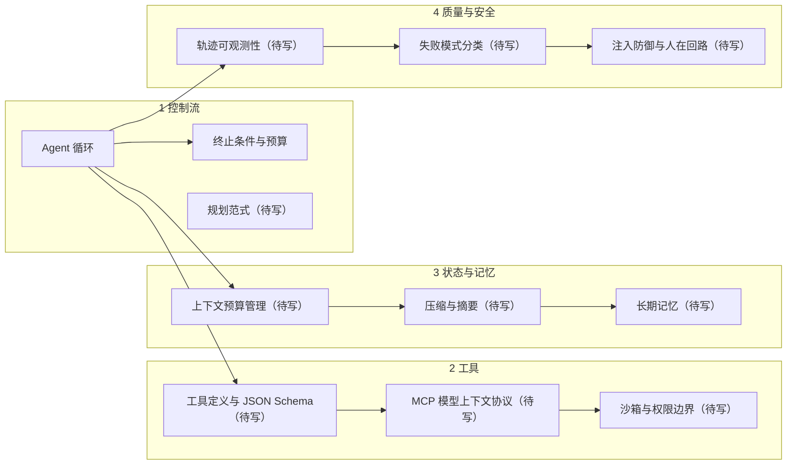

# Agent 地图 · Agent Map

Agent 的复杂度不在模型，在**循环周边的四件事**。四件事里任何一件没做，系统就上不了线。

---

## 四条线

---

## 1 控制流 —— 下一步是谁决定的

这一整块的判断标准只有一条：**下一步做什么，由模型在运行时产生，还是由人预先写死。**

- 模型决定 → Agent，正确性只能靠观察运行轨迹来验证，同样输入两次可能走不同路径
- 人写死 → Workflow，正确性可以静态推理，看代码就知道会走哪条路

**能用 Workflow 解决的不要用 Agent。** 路径可以事先枚举时，Workflow 更便宜、更快、可测试。Agent 的价值只存在于"路径事先无法枚举"的场景——这条界限被跨过之后，下面的四条线全部变成必需品而不是可选项。

| 概念 | 卡片 |
|---|---|
| Agent 循环 | [已写](../concepts/agent/agent-loop.md) |
| 终止条件与预算控制 | 待写 · **P0** |
| ReAct 与规划范式 | 待写 · P1 |
| Plan-and-Execute | 待写 · P2 |
| 单 Agent vs 多 Agent 的取舍 | 待写 · P2 |

**终止条件是 P0 的理由**：没有步数上限、单步超时、成本上限的循环，等于把失控风险交给模型。模型自己不会停——终止必须由外部强制。

「单 Agent vs 多 Agent」标 P2 而不是 P1，是因为它是个**被高估的选项**：多智能体增加的是并行度和职责隔离，不是能力上限，同时带来通信成本与一致性问题。多数场景下，单 Agent 配好工具就够了。

---

## 2 工具 —— 模型的手

工具这一层的质量，对成功率的影响**不低于模型选择**。理由很直接：模型只在给定描述下选择调用，描述没写清楚的能力它不会用，也不会自己发现。

| 概念 | 卡片 |
|---|---|
| 工具定义与 JSON Schema | 待写 · **P0** |
| MCP 模型上下文协议 | 待写 · **P0** |
| 函数调用 Function Calling | 待写 · P1 |
| 代码执行沙箱 | 待写 · P2 |
| 权限与最小授权 | 待写 · P2 |

工具用不对，一半原因在描述。判断一个工具定义是否合格，看三点：**名字是否自解释、用途描述是否说清了什么时候该用、参数模式是否给出了取值范围与单位。** 三点都缺的定义，模型只能猜。

---

## 3 状态与记忆 —— 它其实没有状态

关键认识：**Agent 没有内部状态变量，它的"我做到哪了"完全依赖把历史重放进上下文**（这一条的根在 [上下文窗口](../concepts/ai/context-window.md)）。

所以上下文一旦被截断或污染，Agent 会"失忆"或"记错"，外部表现为重复动作、目标漂移。**长任务跑崩的主因是上下文预算管理，不是模型能力。**

| 概念 | 卡片 |
|---|---|
| 上下文预算管理 | 待写 · **P0** |
| 上下文压缩与摘要 | 待写 · P1 |
| 长期记忆 | 待写 · P2 |
| 结构化状态与外部存储 | 待写 · P2 |

---

## 4 质量与安全 —— 没有轨迹就无法调试

| 概念 | 卡片 |
|---|---|
| 轨迹可观测性与回放 | 待写 · **P0** |
| 失败模式分类（绕圈 / 漂移 / 工具误用） | 待写 · P1 |
| 提示注入防御 | 待写 · P1 |
| 人在回路确认点 HITL | 待写 · P2 |
| Agent 评测 | 待写 · P2 |

**轨迹是 P0 的理由**：Agent 的输出是轨迹，不是单次回答。不记录每一步的输入、决策、工具返回，就没有任何可复现的调试起点——出了问题只能靠猜。

---

## 与 AI 和软件工程的接缝

- **向左**：Agent 的所有限制都源自 [AI 地图](ai.md) 的 L3 推理层。绕开那一层直接学 Agent 框架，会停在"知道怎么调 API"的水平
- **向右**：轨迹日志、超时重试、幂等性、可观测性，全部落在 [软件工程地图](software.md) 的「运行」线上。Agent 工程有一半是普通后端工程
