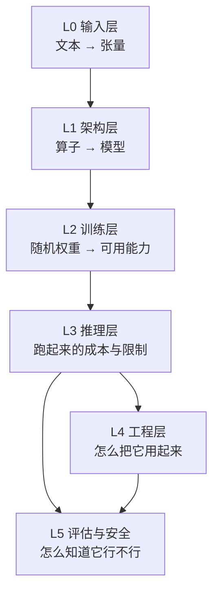

# AI 地图 · AI Map

AI 的知识不是平铺的清单，是**五层堆叠**。每层解决上一层的遗留问题，也引入自己的新限制。

---

## 五层结构

**层与层之间是「问题 → 解法 → 新问题」的关系**，不是分类关系：

| 层 | 解决上一层的什么 | 引入什么新限制 |
|---|---|---|
| L0 输入 | — | 文本要变成离散符号才能进网络，于是有了分词与词表 |
| L1 架构 | 序列建模无法并行 | 注意力是 $O(n^2)$，位置信息需另行注入 |
| L2 训练 | 架构有了但能力为空白 | 需要海量数据与算力，且对齐要额外做 |
| L3 推理 | 权重有了但要跑起来 | 显存、延迟、成本成为硬约束 |
| L4 工程 | 模型能力如何变成产品能力 | 引入检索、提示、评测等一整套工程复杂度 |
| L5 评估 | 怎么判断上面所有工作的效果 | 基准会饱和、会被污染，评估本身成为难题 |

---

## 各层内容

### L0 输入层 —— 文本怎么变成数字

| 概念 | 卡片 |
|---|---|
| 分词 Tokenization | 待写 · **P0** |
| 词嵌入 Embedding | 待写 · P1 |
| 位置编码 Positional Encoding | 待写 · P2 |

为什么 P0：**不理解分词，就无法理解"为什么模型数不清某个词里的字母""为什么中文比英文费 token""为什么同一个词在不同上下文里 token 数不同"。** 这一层是所有后续讨论的前提，也是被跳过最多的一层。

### L1 架构层 —— 算子怎么拼成模型

| 概念 | 卡片 |
|---|---|
| 注意力机制 Attention | [已写](../concepts/ai/attention-mechanism.md) |
| Transformer | [已写](../concepts/ai/transformer.md) |
| 前馈网络 FFN | 待写 · P1 |
| 残差连接与层归一化 | 待写 · P2 |
| 多头注意力 | 待写 · P2（也可并入注意力卡） |
| 专家混合 MoE | 待写 · P2 |

这一层可以**完全脱离语言理解**。先把它当线性代数看，理解成本最低。

### L2 训练层 —— 能力从哪来

| 概念 | 卡片 |
|---|---|
| 训练范式总览（预训练 / SFT / 对齐三者的关系） | 待写 · **P0** |
| 预训练与自监督目标 | 待写 · P1 |
| 监督微调 SFT | 待写 · P1 |
| 指令微调与对话格式 | 待写 · P1 |
| LoRA 与参数高效微调 | 待写 · P1 |
| RLHF | 待写 · P2 |
| DPO | 待写 · P2 |
| 知识蒸馏 | 待写 · P2 |
| 缩放定律 | 待写 · P2 |

这一层目前**完全空白**，是全库最大的缺口。缺了它，后面关于"模型为什么会有这些行为边界"的讨论全部没有依据——包括幻觉、对齐、以及为什么微调不能注入新知识。

### L3 推理层 —— 跑起来要多少钱

| 概念 | 卡片 |
|---|---|
| 上下文窗口 Context Window | [已写](../concepts/ai/context-window.md) |
| 推理成本与显存估算 | 待写 · **P0** |
| KV Cache | 待写 · P1 |
| 采样策略（温度 / Top-p） | 待写 · P1 |
| 量化 Quantization | 待写 · P2 |
| 推理引擎与服务化 | 待写 · P2 |

「推理成本与显存估算」标 P0 的理由很实际：**这是判断一个方案可行不可行的第一步**。"用 128k 上下文跑全量文档"这类决定，能不能做，先算一笔账就知道，不必试。

### L4 工程层 —— 怎么用起来

| 概念 | 卡片 |
|---|---|
| 提示工程 Prompt Engineering | 待写 · **P0** |
| RAG 检索增强生成 | 待写 · **P0** |
| 向量检索 | 待写 · P1 |
| 重排序 Reranking | 待写 · P2 |
| 模型选型与成本权衡 | 待写 · P2 |

这一层与 [Agent 地图](agent.md) 直接衔接：Agent 的每一步都要用到这里的检索与提示能力。

### L5 评估与安全 —— 怎么知道行不行

| 概念 | 卡片 |
|---|---|
| 评估方法论（基准之外怎么判断） | 待写 · P1 |
| 幻觉 Hallucination | 待写 · P1 |
| 对齐 Alignment | 待写 · P2 |
| 提示注入与越狱 | 待写 · P2 |
| 基准与基准污染 | 待写 · P2 |

不建这一层，前面所有理解都**无法被检验**。评估不是收尾工作，它决定你能不能用数据推翻自己的判断。

---

## 三种常见错误读法

1. **从"大模型"这个词入手。** 营销词不是概念，它不指向任何可验证的机制。从 L0 或 L1 的具体算子入手。
2. **先学 Prompt 工程，再学架构。** 结果是记住了大量"技巧"，但无法判断哪条技巧为什么有效、什么时候会失效——因为不知道模型内部发生了什么。顺序应该是 L1 → L3 → L4。
3. **跳过 L2 直接看对齐。** 会把 RLHF / DPO 理解成"让模型变聪明的技术"。它们不增加知识，只改变输出的偏好分布；不知道这一点，就会误以为微调能"教会"模型新事实。

---

## 与 Agent 的衔接点

L3 的[上下文窗口](../concepts/ai/context-window.md)是 AI 与 Agent 两块的接缝：**它的限制直接决定了 Agent 循环能跑多久、要怎么做状态管理。** 从这张卡往 [Agent 地图](agent.md) 走。
