# AI 地图 · AI Map

AI 的知识不是平铺的清单，是**五层堆叠**。每层解决上一层的遗留问题，也引入自己的新限制。

> 这张图只画依赖关系。把每层"为什么存在、每部分起什么作用"讲成文字的版本，见 [`docs/ai-composition.md`](../docs/ai-composition.md)。

---

## 六层结构（L0–L5）

```mermaid
flowchart TD
    subgraph G_ai["AI / 模型"]
    n_alignment["对齐"]
    n_attention_mechanism["注意力机制"]
    n_benchmarks["基准与基准污染"]
    n_context_window["上下文窗口"]
    n_dpo["直接偏好优化"]
    n_embedding["词嵌入"]
    n_evaluation["评估方法论"]
    n_feed_forward_network["前馈网络"]
    n_hallucination["幻觉"]
    n_inference_cost["推理成本与显存估算"]
    n_inference_engines["推理引擎与服务化"]
    n_instruction_tuning["指令微调与对话格式"]
    n_jailbreak["越狱与红队测试"]
    n_knowledge_distillation["知识蒸馏"]
    n_kv_cache["键值缓存"]
    n_lora["LoRA 与参数高效微调"]
    n_model_selection["模型选型与成本权衡"]
    n_moe["专家混合"]
    n_multi_head_attention["多头注意力"]
    n_positional_encoding["位置编码"]
    n_pretraining["预训练与自监督目标"]
    n_prompt_engineering["提示工程"]
    n_quantization["量化"]
    n_rag["RAG 检索增强生成"]
    n_reranking["重排序"]
    n_residual_and_normalization["残差连接与层归一化"]
    n_rlhf["基于人类反馈的强化学习"]
    n_sampling["采样策略"]
    n_scaling_laws["缩放定律"]
    n_sft["监督微调"]
    n_tokenization["分词"]
    n_training_paradigms["训练范式总览"]
    n_transformer["Transformer 架构"]
    n_vector_search["向量检索"]
    end
    n_rlhf --> n_alignment
    n_dpo --> n_alignment
    n_evaluation --> n_benchmarks
    n_attention_mechanism --> n_context_window
    n_transformer --> n_context_window
    n_rlhf --> n_dpo
    n_tokenization --> n_embedding
    n_prompt_engineering --> n_evaluation
    n_transformer --> n_feed_forward_network
    n_pretraining --> n_hallucination
    n_context_window --> n_inference_cost
    n_inference_cost --> n_inference_engines
    n_kv_cache --> n_inference_engines
    n_sft --> n_instruction_tuning
    n_alignment --> n_jailbreak
    n_sft --> n_knowledge_distillation
    n_attention_mechanism --> n_kv_cache
    n_inference_cost --> n_kv_cache
    n_sft --> n_lora
    n_evaluation --> n_model_selection
    n_inference_cost --> n_model_selection
    n_feed_forward_network --> n_moe
    n_attention_mechanism --> n_multi_head_attention
    n_attention_mechanism --> n_positional_encoding
    n_transformer --> n_pretraining
    n_context_window --> n_prompt_engineering
    n_inference_cost --> n_quantization
    n_context_window --> n_rag
    n_vector_search --> n_reranking
    n_transformer --> n_residual_and_normalization
    n_sft --> n_rlhf
    n_context_window --> n_sampling
    n_pretraining --> n_scaling_laws
    n_pretraining --> n_sft
    n_transformer --> n_training_paradigms
    n_attention_mechanism --> n_transformer
    n_embedding --> n_vector_search
```

**层与层之间是「问题 → 解法 → 新问题」的关系**，不是分类关系：

| 层 | 解决上一层的什么 | 引入什么新限制 |
|---|---|---|
| L0 输入 | — | 文本要变成离散符号才能进网络，于是有了分词与词表 |
| L1 架构 | 序列建模无法并行 | 注意力是 $O(n^2)$，位置信息需另行注入 |
| L2 训练 | 架构有了但能力为空白 | 需要海量数据与算力，且对齐要额外做 |
| L3 推理 | 权重有了但要跑起来 | 显存、延迟、成本成为硬约束 |
| L4 工程 | 模型能力如何变成产品能力 | 引入检索、提示、评测等一整套工程复杂度 |
| L5 评估 | 怎么判断上面所有工作的效果 | 基准会饱和、会被污染，评估本身成为难题 |

---

## 各层内容

### L0 输入层 —— 文本怎么变成数字

| 概念 | 卡片 |
|---|---|
| 分词 Tokenization | [分词](../concepts/ai/tokenization.md) |
| 词嵌入 Embedding | [词嵌入](../concepts/ai/embedding.md) |
| 位置编码 Positional Encoding | [位置编码](../concepts/ai/positional-encoding.md) |

为什么这一层最容易被跳过：**不理解分词，就无法理解"为什么模型数不清某个词里的字母""为什么中文比英文费 token"。** 它是所有后续讨论的前提。

### L1 架构层 —— 算子怎么拼成模型

| 概念 | 卡片 |
|---|---|
| 注意力机制 Attention | [注意力机制](../concepts/ai/attention-mechanism.md) |
| Transformer | [Transformer 架构](../concepts/ai/transformer.md) |
| 多头注意力 | [多头注意力](../concepts/ai/multi-head-attention.md) |
| 前馈网络 FFN | [前馈网络](../concepts/ai/feed-forward-network.md) |
| 残差连接与层归一化 | [残差与层归一化](../concepts/ai/residual-and-normalization.md) |
| 专家混合 MoE | [专家混合](../concepts/ai/moe.md) |

这一层可以**完全脱离语言理解**。先把它当线性代数看，理解成本最低。

### L2 训练层 —— 能力从哪来

| 概念 | 卡片 |
|---|---|
| 训练范式总览（预训练 / SFT / 对齐三者的关系） | [训练范式总览](../concepts/ai/training-paradigms.md) |
| 预训练与自监督目标 | [预训练](../concepts/ai/pretraining.md) |
| 监督微调 SFT | [监督微调](../concepts/ai/sft.md) |
| 指令微调与对话格式 | [指令微调](../concepts/ai/instruction-tuning.md) |
| LoRA 与参数高效微调 | [LoRA](../concepts/ai/lora.md) |
| RLHF | [RLHF](../concepts/ai/rlhf.md) |
| DPO | [DPO](../concepts/ai/dpo.md) |
| 知识蒸馏 | [知识蒸馏](../concepts/ai/knowledge-distillation.md) |
| 缩放定律 | [缩放定律](../concepts/ai/scaling-laws.md) |

**这一层是理解模型行为边界的依据**：缺了它，关于幻觉、对齐、微调为什么不能注入知识的讨论都没有根据。建议从「训练范式总览」入手，它是这一层的索引。

### L3 推理层 —— 跑起来要多少钱

| 概念 | 卡片 |
|---|---|
| 上下文窗口 Context Window | [上下文窗口](../concepts/ai/context-window.md) |
| 推理成本与显存估算 | [推理成本与显存估算](../concepts/ai/inference-cost.md) |
| KV Cache | [KV Cache](../concepts/ai/kv-cache.md) |
| 采样策略（温度 / Top-p） | [采样策略](../concepts/ai/sampling.md) |
| 量化 Quantization | [量化](../concepts/ai/quantization.md) |
| 推理引擎与服务化 | [推理引擎与服务化](../concepts/ai/inference-engines.md) |

「推理成本与显存估算」的价值很实际：**这是判断一个方案可行不可行的第一步**。"用 128k 上下文跑全量文档"这类决定，能不能做，先算一笔账就知道，不必试。

### L4 工程层 —— 怎么用起来

| 概念 | 卡片 |
|---|---|
| 提示工程 Prompt Engineering | [提示工程](../concepts/ai/prompt-engineering.md) |
| RAG 检索增强生成 | [RAG](../concepts/ai/rag.md) |
| 向量检索 | [向量检索](../concepts/ai/vector-search.md) |
| 重排序 Reranking | [重排序](../concepts/ai/reranking.md) |
| 模型选型与成本权衡 | [模型选型](../concepts/ai/model-selection.md) |

这一层与 [Agent 地图](agent.md) 直接衔接：Agent 的每一步都要用到这里的检索与提示能力。

### L5 评估与安全 —— 怎么知道行不行

| 概念 | 卡片 |
|---|---|
| 评估方法论 | [评估方法论](../concepts/ai/evaluation.md) |
| 基准与基准污染 | [基准与基准污染](../concepts/ai/benchmarks.md) |
| 幻觉 Hallucination | [幻觉](../concepts/ai/hallucination.md) |
| 对齐 Alignment | [对齐](../concepts/ai/alignment.md) |
| 越狱与红队测试 | [越狱与红队测试](../concepts/ai/jailbreak.md) |

不建这一层，前面所有理解都**无法被检验**。评估不是收尾工作，它决定你能不能用数据推翻自己的判断。

---

## 三种常见错误读法

1. **从"大模型"这个词入手。** 营销词不是概念，它不指向任何可验证的机制。从 L0 或 L1 的具体算子入手。
2. **先学 Prompt 工程，再学架构。** 结果是记住了大量"技巧"，但无法判断哪条技巧为什么有效、什么时候会失效。顺序应该是 L1 → L3 → L4。
3. **跳过 L2 直接看对齐。** 会把 RLHF / DPO 理解成"让模型变聪明的技术"。它们不增加知识，只改变输出的偏好分布。

---

## 与 Agent 的衔接点

L3 的[上下文窗口](../concepts/ai/context-window.md)是 AI 与 Agent 两块的接缝：**它的限制直接决定了 Agent 循环能跑多久、要怎么做状态管理。** 从这张卡往 [Agent 地图](agent.md) 走。
