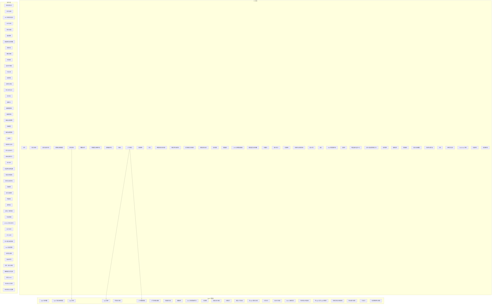

# 总图 · Overview

三个领域不是并列关系，而是层层叠加：

> **AI 是底座**（能力从哪来）→ **Agent 是控制流**（怎么让它自己推进）→ **软件工程是工程约束**（怎么让它可靠地跑起来）。

---

## 全库总图

实线 = 前置依赖，箭头方向即阅读方向。总图只画跨领域的衔接边——各领域内部的依赖顺序，在对应的领域地图里看。

节点不加链接（GitHub 对图内链接支持不稳定），链接在下面的表里。

---

## 四步主线

最短的一条能读通的路：

| 顺序 | 卡片 | 这一层要建立的核心认识 |
|---|---|---|
| 1 | [注意力机制](../concepts/ai/attention-mechanism.md) | 一个算子：按相关度做加权聚合。纯数学，可脱离语言理解 |
| 2 | [Transformer 架构](../concepts/ai/transformer.md) | 把算子组装成架构。重点是"为什么并行化、代价是什么" |
| 3 | [上下文窗口](../concepts/ai/context-window.md) | 架构带来的硬约束。核心认识：**模型无状态，所谓记忆是重放** |
| 4 | [Agent 循环](../concepts/agent/agent-loop.md) | 约束之上长出控制流。多数 Agent 工程问题是第 3 步的预算问题 |

第 3 步是这个库的分水岭。**没建立"模型无状态"这一条，后面所有关于 Agent、RAG、长上下文的理解都会长在错的地基上。**

---

## 卡住时的诊断

概念本身没有内在顺序，但理解有先后。顺序错了会出现"每个字都认识、连起来不懂"的状态。

| 卡在这张 | 典型症状 | 说明上一环的哪个认识没建立 |
|---|---|---|
| [注意力机制](../concepts/ai/attention-mechanism.md) | 说不清缩放因子为什么是 $\sqrt{d_k}$ | —（这是起点） |
| [Transformer](../concepts/ai/transformer.md) | 说不清位置编码为什么必需 | 没抓住"注意力是位置无关的"——它不知道谁在前谁在后 |
| [上下文窗口](../concepts/ai/context-window.md) | 以为"窗口大 = 记得住" | 没抓住"每次前向是独立计算、算完就丢" |
| [Agent 循环](../concepts/agent/agent-loop.md) | 说不清 Agent 和 Workflow 的界线 | 没建立"状态载体即上下文"的认识 |

规律：**卡在第 $n$ 步，问题通常在 $n-1$ 步。** 往回退，不要硬读。

---

## 领域地图

| 地图 | 内容 |
|---|---|
| [AI 地图](ai.md) | 从算子到系统的五层结构 |
| [Agent 地图](agent.md) | 控制流、工具、状态、质量四条线 |
| [软件工程地图](software.md) | 设计、正确性、变更、运行四条线 |

---

## 当前进度

| | 数量 |
|---|---|
| 已写卡片 | 112 |
| 清单待写 | 0（第四批 38 项已全部处理：35 项成卡 + 3 项明确排除） |
| 前置链断点（P0） | 12 个，已补齐 |
| 主干概念（P1） | 26 个，已补齐 |
| 补充与延伸（P2） | 34 个，已补齐 |
| 信源等级 | 111 张 `link-checked`，1 张 `unverified` |

概念已铺齐，来源链接也已逐条机器核验（35 个 arXiv 编号零错配）。但**正文表述与来源原文尚未逐条比对**，数量级数字也未实测——所以现在的正确用法仍是当作索引与提问清单，不是当作事实依据。核查记录见 [`docs/verification-log.md`](../docs/verification-log.md)；第 2 轮逐卡核查清单见 [`docs/round2-verification-checklist.md`](../docs/round2-verification-checklist.md)。

本页的 Mermaid 图由 [`scripts/build_maps.py`](../scripts/build_maps.py) 从各卡「前置」字段自动生成，**不要手改图**——加卡或改前置后跑一次脚本即可同步，CI 也会比对一致性。

每一项的明细和优先级见 [概念清单](../roadmap.md)。**清单里未勾选的部分，就是这个库当前承认的缺口**——把它显式写出来，比靠记忆维护 TODO 可靠。
