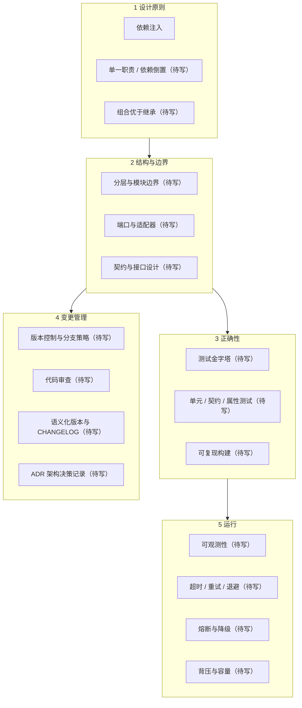

# 软件工程地图 · Software Engineering Map

软件工程的概念多数不是"知识"，而是**权衡的记法**。每一条原则背后都有一个具体的失败模式，理解那条失败模式比记住原则名字有用。

这一块只收**跨项目通用**的概念。具体框架、语言特性、部署工具不收——那些属于文档，不属于概念。

---

## 四条线

---

## 1 设计原则 —— 让变化点待在边界上

设计原则的共同形式是：**把会变的东西推到外面去**。

[依赖注入](../concepts/software/dependency-injection.md) 是这条思路最清晰的一个例子——它把"用哪个实现"的决定权从被使用者手里搬到调用方。单一职责、依赖倒置、组合优于继承都是同一件事在不同切面上的表述。

判断一条原则该不该在这个项目里用，问一句：**这里有没有第二种实现，或者预计会不会有？** 两个都是否，抽象就只是增加了一层间接。

| 概念 | 卡片 |
|---|---|
| 依赖注入 / 控制反转 | [已写](../concepts/software/dependency-injection.md) |
| 单一职责与职责划分 | 待写 · P1 |
| 依赖倒置原则 | 待写 · P1 |
| 组合优于继承 | 待写 · P2 |
| 幂等性 | 待写 · P2 |

---

## 2 结构与边界 —— 改一处不该动全身

| 概念 | 卡片 |
|---|---|
| 分层架构与模块边界 | 待写 · P1 |
| 端口与适配器 | 待写 · P1 |
| 领域模型 | 待写 · P2 |
| 契约与接口设计 | 待写 · P2 |

这一条线回答的问题是"**改动的影响半径有多大**"。边界画得对，局部修改不会外溢；画错了，任何小改动都要理解整个系统。

---

## 3 正确性 —— 测试写在哪一层

| 概念 | 卡片 |
|---|---|
| 测试金字塔 | 待写 · **P0** |
| 单元测试与可测性 | 待写 · P1 |
| 契约测试 | 待写 · P1 |
| 属性测试 | 待写 · P2 |
| 可复现构建 | 待写 · P2 |

「测试金字塔」标 P0 是因为它决定**其它测试怎么安排**：哪个层次多写、哪个层次少写、为什么不能全压在端到端。跳过它直接学"怎么写单元测试"，会得到一堆比例失衡、跑得慢、还不敢改的测试。

---

## 4 变更管理 —— 一年后还看得懂吗

| 概念 | 卡片 |
|---|---|
| 版本控制与分支策略 | 待写 · **P0** |
| 代码审查 | 待写 · P1 |
| 语义化版本 | 待写 · P1 |
| 变更日志 CHANGELOG | 待写 · P2 |
| 架构决策记录 ADR | 待写 · P2 |
| 技术债与重构 | 待写 · P2 |

这一条线的价值随时间显现，所以最容易被跳过。**ADR 是其中收益最高、成本最低的一条**：把"当时为什么这么选"写下来，几行字，替代的是一次完整的重新论证。

---

## 5 运行 —— 上线之后才是开始

| 概念 | 卡片 |
|---|---|
| 可观测性（日志 / 指标 / 追踪） | 待写 · P1 |
| 超时、重试与退避 | 待写 · P1 |
| 熔断与降级 | 待写 · P2 |
| 背压与容量 | 待写 · P2 |

**这一条线与 [Agent 地图](agent.md) 直接重叠。** 轨迹日志、循环超时、工具调用的幂等与重试，本质是普通后端工程搬到 Agent 上。不熟悉这一条线，Agent 就只能停在 demo 阶段。

---

## 一个提醒

这张地图刻意不收框架和工具。判断标准：**换一个语言或框架之后，这个概念还成立吗？** 成立就收，不成立就不收。

所以这里没有 Spring、没有 React、没有 Kubernetes。它们是好工具，但它们是文档的内容，不是概念的内容——而文档随时会变，概念不会。
